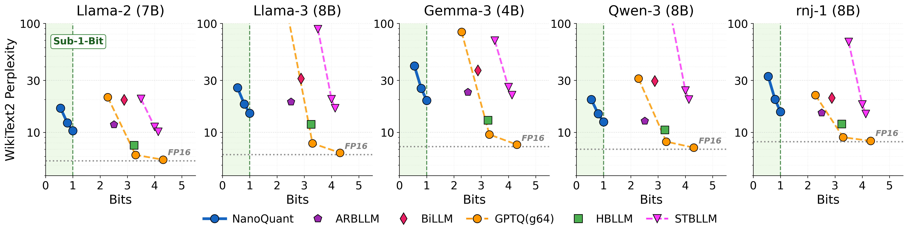
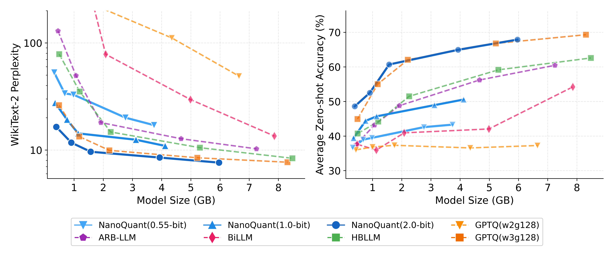

<h1>NanoQuant: Efficient Sub-1-Bit Quantization<br>of Large Language Models</h1>
<h4>Authors: <a href="mailto:c42.hyochan@samsung.com">Hyochan Chong</a><sup>*</sup>, <a href="mailto:dongkyu.k@samsung.com">Dongkyu Kim</a><sup>*,&dagger;</sup>, <a href="mailto:c046385.kim@samsung.com">Changdong Kim</a>, <a href="mailto:manner.choi@samsung.com">Minseop Choi</a></h4>
<p><sup>*</sup>Equal Contribution, <sup>&dagger;</sup>Corresponding Author</p>

---

[](https://arxiv.org/abs/2602.06694)
[](https://huggingface.co/papers/2602.06694)
[](https://icml.cc/virtual/2026/poster/61392)


**NanoQuant** is a **post-training quantization** algorithm that enables **sub-1-bit** LLM weight quantization.

<div align="center">

</div>

---

## Abstract

> **NanoQuant** is a state-of-the-art post-training quantization method that can compress LLMs to **sub-1-bit levels**. It introduces a novel non-factored/factored decomposition of weight matrices which, combined with learnable mixture-of-rank binary bases, achieves extreme compression while preserving model accuracy. By iteratively optimizing bases via ADMM and compensating per-layer quantization error, NanoQuant enables up to **over 3x faster decoding** and **10x smaller memory footprints**, pushing the frontier of practical ultra-low-bit LLM deployment.

---

## Key Features

### Method & Efficiency
* **Sub-1-bit Compression:** Pushes quantization below 1 bit per weight via mixture-of-rank binary bases.
* **Post-Training Quantization (PTQ):** No retraining required; calibration-only compression.
* **State-of-the-art Decoding Speed:** Up to **3x faster** inference via optimized binary GEMV/GEMM kernels.
* **Extreme Memory Reduction:** Up to **10x smaller** model footprints compared to FP16.

### Supported Models
The codebase currently supports the following architectures:
* **OPT**
* **Llama** (Llama-1, Llama-2, Llama-3)
* **Qwen** (Qwen-2.5, Qwen-3)
* **Gemma** (Gemma-2, Gemma-3)
* **Rnj-1**

### Custom GPU Kernels
* **GEMM (prefill):** CUDA
* **GEMV (decode):** CUDA

---

## 📦 Installation

```bash
# create conda environment
conda create -n nanoquant python=3.12 -y
conda activate nanoquant

# Install dependencies
pip install .

# Compile CUDA kernels
cd src/nanoquant/kernel
bash compile_kernel.sh
```

---

## 🎯 Usage

### Basic Quantization

Compress a model using the main NanoQuant script. Below is an example for Llama-2-7b:

```bash
python -m nanoquant.main \
    --model_id meta-llama/Llama-2-7b-hf/ \
    --qmodel_path "Llama-2-7b-hf-1bit.pt" \
    --num_calib_samples 128 \
    --nonfact_epochs 8 \
    --fact_epochs 8 \
    --admm_outer_iters 400 \
    --ppl_task "wikitext2"
```

### Very Large Models (>70B)

For models that may not fit in CPU memory, use `--device_map auto` to enable GPU+CPU offloading:

```bash
python -m nanoquant.main \
    --model_id meta-llama/Llama-3-70B-Instruct \
    --device_map auto \
    --num_calib_samples 128 \
    --nonfact_epochs 8 \
    --fact_epochs 8 \
    --admm_outer_iters 400 \
    --ppl_task "wikitext2"
```

### Kernel Benchmarking

Run custom CUDA kernels for GEMV and GEMM decode-stage benchmarking. Save a 1-bit model (e.g., `Llama-3.2-1B-NQ-1bit.pt`) in the repo root, then:

```bash
# Run benchmark
cd src/nanoquant/kernel
bash bench_decode.sh
```

---

## Results

### Pareto Accuracy

We compare results across pretrained models in the Qwen3 family (0.6B, 1.7B, 4B, 8B, 14B):

<div align="center">

</div>

## GPU Kernel Performance

NanoQuant implements matmul-free GEMV kernels that do not require NVIDIA Tensor Cores. All tests are conducted with 128 input tokens.

### NanoQuant vs <a href="https://github.com/dropbox/gemlite">GemLite</a>

NanoQuant GEMV kernels outperform state-of-the-art binary Triton kernels from GemLite.

<div align="center">

</div>

### NanoQuant vs. Vector Quantization

NanoQuant GEMV kernels also outperform vector quantization kernels in both speed and memory efficiency.

<div align="center">

</div>

---

## Citation

If you find NanoQuant useful or relevant to your research, please kindly cite our paper:

```bibtex
@article{chong2026nanoquant,
  title={NanoQuant: Efficient Sub-1-Bit Quantization of Large Language Models},
  author={Chong, Hyochan and Kim, Dongkyu and Kim, Changdong and Choi, Minseop},
  journal={arXiv preprint arXiv:2602.06694},
  year={2026}
}
```

## License

This project is licensed under the [Apache 2.0](https://www.apache.org/licenses/LICENSE-2.0) license.
